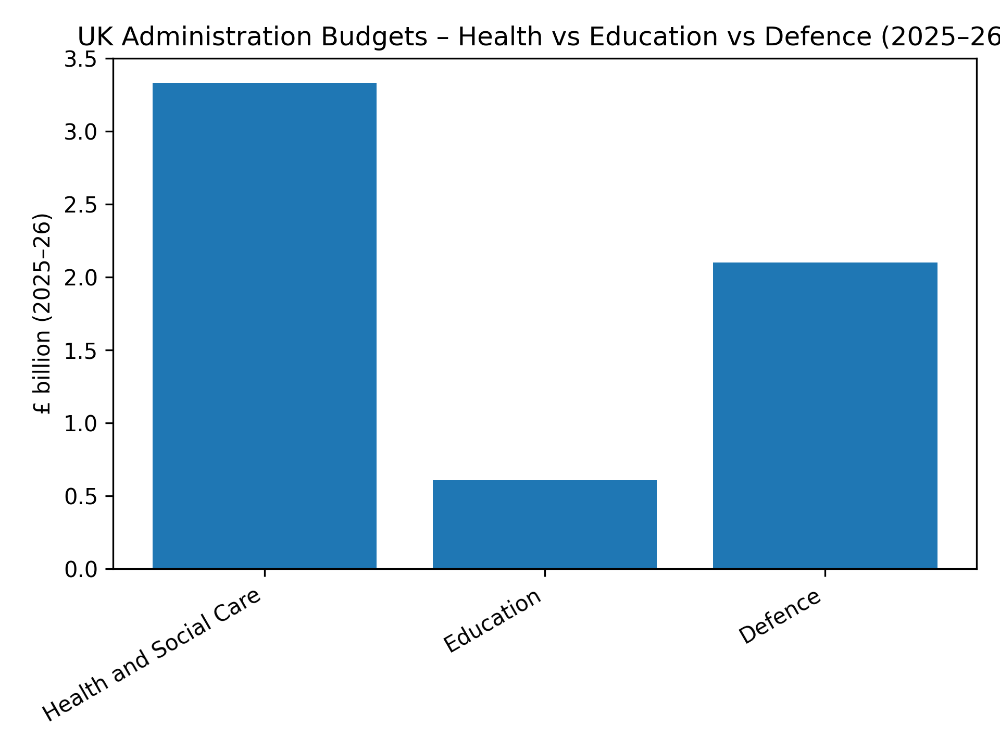
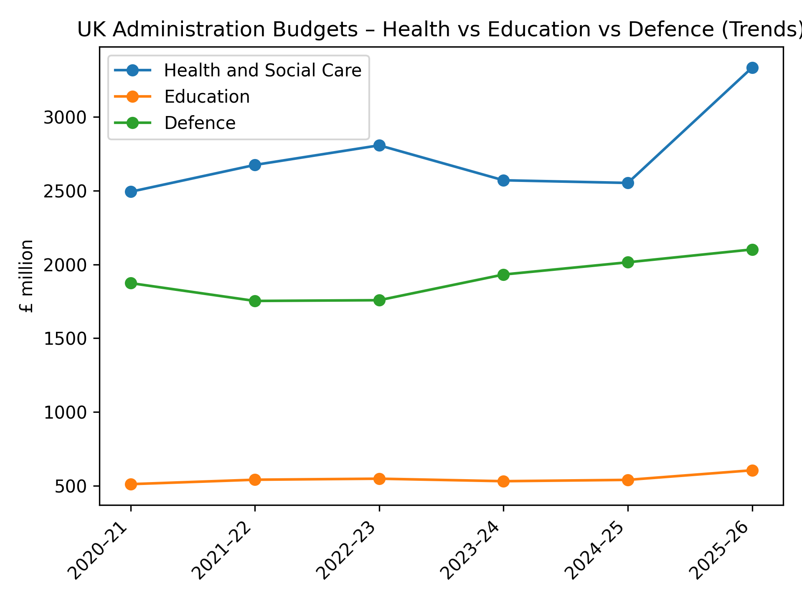

# UK Public Spending Analysis (Python)

This project analyses UK departmental administration budgets using publicly available HM Treasury (PESA) data. The focus is on Health, Education, and Defence spending between 2020–21 and 2025–26.

## What This Project Does
- Loads multi-sheet UK government Excel data
- Cleans messy real-world financial tables
- Extracts department-level budgets
- Compares Health, Education & Defence
- Visualises:
  - One-year spending comparison (2025–26)
  - Multi-year spending trends (2020–21 to 2025–26)

## Tools Used
- Python  
- pandas  
- matplotlib  

## Data Source
HM Treasury – Public Expenditure Statistical Analyses (PESA)

## Key Findings
- Health administration budgets are the highest across the period  
- Defence budgets show a steady upward trend  
- Education budgets remain relatively stable by comparison  

## Visual Results

### UK Administration Budgets (2025–26)
This chart compares the latest available administration budgets for Health, Education, and Defence.

### Multi-Year Budget Trends (2020–21 to 2025–26)
This chart shows how administration budgets for the three departments have changed over time.

## How to Run
1. Install dependencies:

## Author
Daniel Pink
