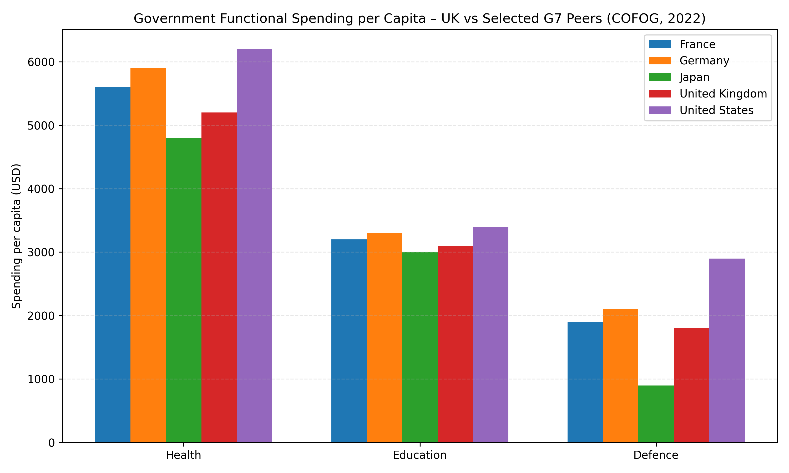

# UK Public Spending Analysis (Python)

## Overview
This project analyses UK government spending trends using Python, combining:

- UK departmental administration budget data from HM Treasury (PESA)
- International per-capita comparisons using OECD COFOG functional expenditure data.

The analysis focuses on Health, Education, and Defence, bringing together multi-year UK budget trends with cross-country benchmarking against certain G7 peers.

## Key Findings
- **UK administration spending changes are uneven across policy areas.**  
  Planned administration budgets for Health, Education, and Defence show different growth trajectories between 2020–21 and 2025–26.

- **Health administration budgets show the strongest growth over the period.**  
  The percentage growth output and trend chart indicate larger planned increases for Health relative to Education and Defence.

- **Education grows more modestly in comparison.**  
  Education shows steadier, lower growth over the same period.

- **Defence follows a distinct pattern.**  
  Defence administration budgets behave differently from Health and Education, highlighting that pressures in defence spending may sit outside administrative functions.

- **Internationally, the UK sits generally within the range of major G7 peers.**  
  Per-capita COFOG comparisons show the UK is not consistently an extreme outlier across Health, Education, and Defence, though differences by function are visible.

- **Peer-to-peer comparison provides clearer insight than aggregated averages.**  
  Comparing the UK directly to individual G7 countries highlights differences that can be obscured by a single combined benchmark.

## Data Sources

### UK Data
- HM Treasury – Public Expenditure Statistical Analyses (PESA)
- Table 1.7: Administration budgets by department
- Financial years: 2020–21 to 2025–26
- Figures reflect real-terms UK budget plans

### International Data
- OECD COFOG (Classification of the Functions of Government)
- Per-capita expenditure is in USD
- Latest harmonised year available: 2022

Note: International comparisons are based on the latest year with consistent COFOG coverage across countries. UK budget analysis uses forward-looking national plans, so the two sections intentionally cover different timeframes.

## Analysis Structure

### 1) UK Administration Budget Trends (PESA)
UK PESA data is filtered to **Health, Education, and Defence**, producing:

- A 2025–26 budget comparison bar chart
- A multi-year trend chart (2020–21 to 2025–26)

**2025–26 administration budget comparison**

**Multi-year administration budget trends (2020–21 to 2025–26)**

### 2) Percentage Growth Analysis (PESA)
The project calculates percentage change in administration budgets between 2020–21 and 2025–26.

- `results/percentage_growth_2020_2025.csv`

### 3) International Comparison: UK vs Selected G7 Peers (COFOG)
Using OECD COFOG per-capita data, the UK is compared directly with selected G7 peers:

- United States
- France
- Germany
- Japan

This comparison focuses on functional spending priorities rather than headline totals, and uses direct peer benchmarking.

**Per-capita government functional spending comparison (COFOG, 2022)**

## Methodology Notes
- UK and international analyses are deliberately kept separate to preserve data integrity. COFOG data is used for functional comparability, while PESA is used for UK budget analysis.
 All charts and tables are generated using Python to support reproducibility and transparency.

## Tools & Techniques
- Python
- pandas (data cleaning, filtering, aggregation)
- matplotlib (visualisation)
- Excel / CSV ingestion
- GitHub – documentation

## Project Purpose
This project was developed to:

- Work with public-sector datasets
- Apply analytical judgement to data comparability issues
- Produce clear, reproducible outputs suitable for policy and financial analysis contexts
- Demonstrate practical Python data analysis skills

# Author
Daniel Pink