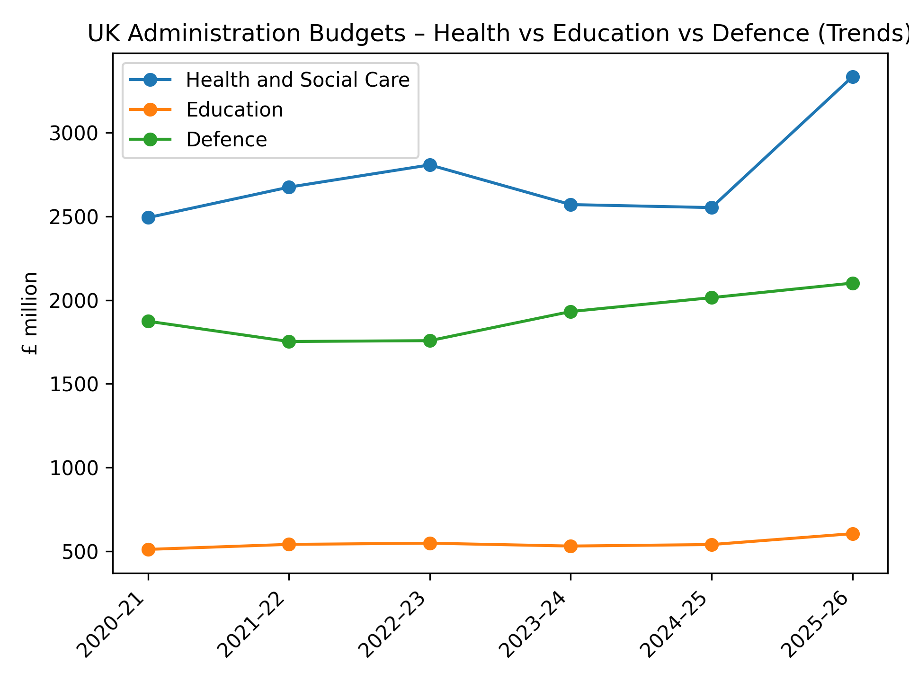

# UK Public Spending Analysis (Python)

This project analyses UK departmental administration budgets using publicly available HM Treasury (PESA) data. The focus is on Health, Education, and Defence spending between 2020-21 and 2025-26.

## What This Project Does
- Loads multi-sheet UK government Excel data
- Cleans messy real-world financial tables
- Extracts department-level budgets
- Compares Health, Education & Defence
- Visualises:
  - One-year spending comparison (2025-26)
  - Multi-year spending trends (2020-21 to 2025-26)

## Tools Used
- Python  
- pandas  
- matplotlib  

## Data Source
HM Treasury – Public Expenditure Statistical Analyses (PESA)

## Methodology and Real-Terms Analysis

The analysis in this project uses data from HM Treasury’s Public Expenditure Statistical Analyses (PESA), which is published in **real terms**.

Therefore:
- Figures are already adjusted for inflation
- Changes over time reflect real purchasing power, not price level increases

## Key Findings
- Health administration budgets are the highest across the period  
- Defence budgets show a steady upward trend  
- Education budgets remain relatively stable by comparison  

## Visual Results

### UK Administration Budgets (2025-26)
This chart compares the latest available administration budgets for Health, Education, and Defence.

### Multi-Year Budget Trends (2020-21 to 2025-26)
This chart shows how administration budgets for the three departments have changed over time.

## Percentage Growth Analysis (2020-21 to 2025-26)

In addition to visual trends, this project calculates the percentage change in administration budgets for Health, Education, and Defence over the five-year period.

This provides a clear comparison of **relative budget growth**, not just absolute spending levels.

The full calculated results are available here:
`results/percentage_growth_2020_2025.csv`

## Policy Narrative and Interpretation

The analysis highlights several important real-terms trends in UK departmental administration budgets between 2020–21 and 2025–26.

Health administration spending shows the largest real-terms increase over the period, reflecting sustained pressure on health services and the prioritisation of healthcare capacity following the COVID-19 pandemic. Even after adjusting for inflation, Health remains the dominant contributor to overall administrative spending growth.

Defence administration budgets also increased notably in real terms. This aligns with a broader shift in government priorities toward national security, geopolitical risk, and defence capability in response to international developments during the period.

Education administration spending grows more modestly in real terms. While budgets increase in cash terms, the relatively slower real-terms growth suggests tighter administrative funding compared to Health and Defence, indicating differing policy priorities.

Overall, the results suggest that real-terms growth in administration budgets has been **uneven**, with spending increases concentrated in departments facing operational and strategic pressures rather than evenly distributed across government. This represents shifting government priorities in a changing domestic and geopolitical landscape.

## How to Run
1. Install dependencies:

## Author
Daniel Pink
